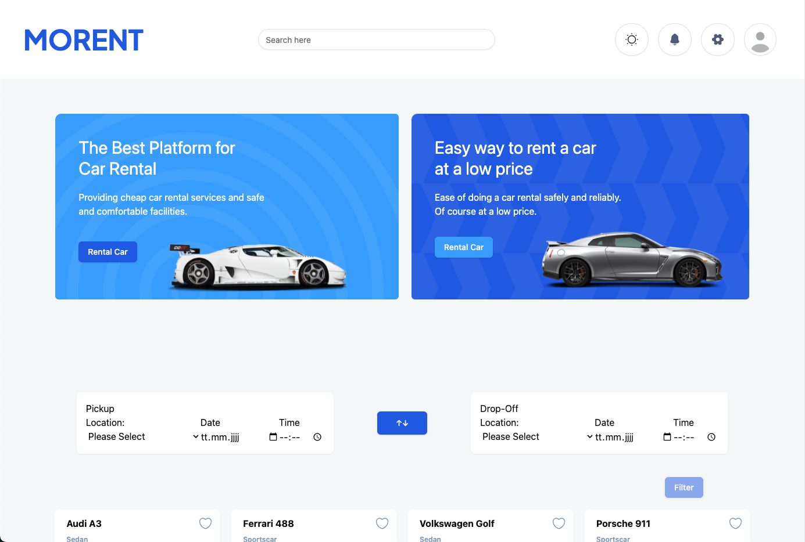
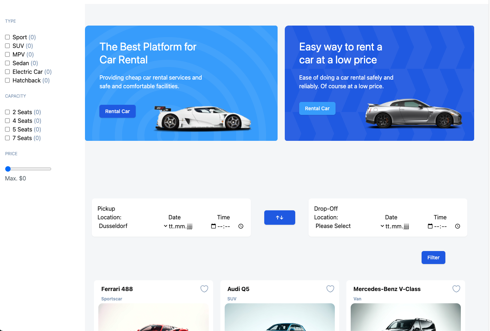
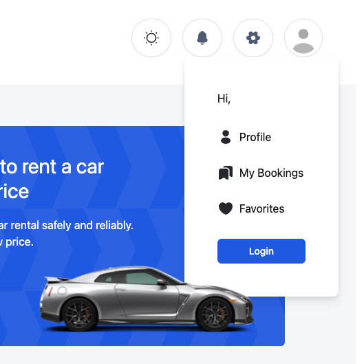
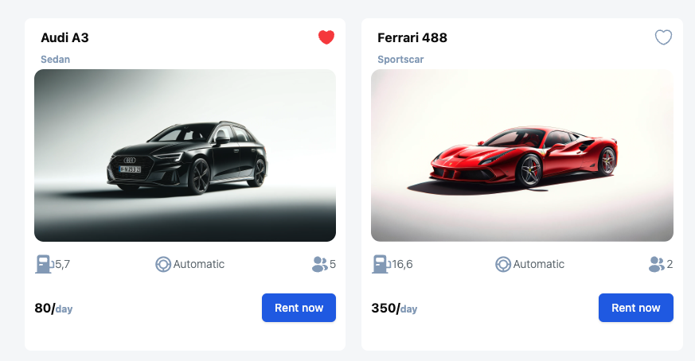
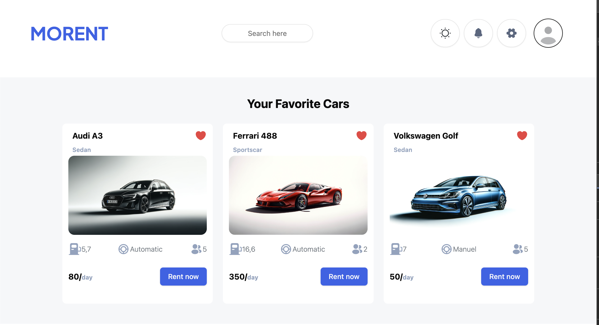
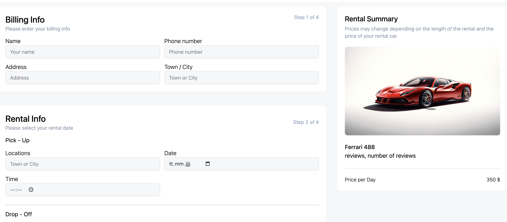
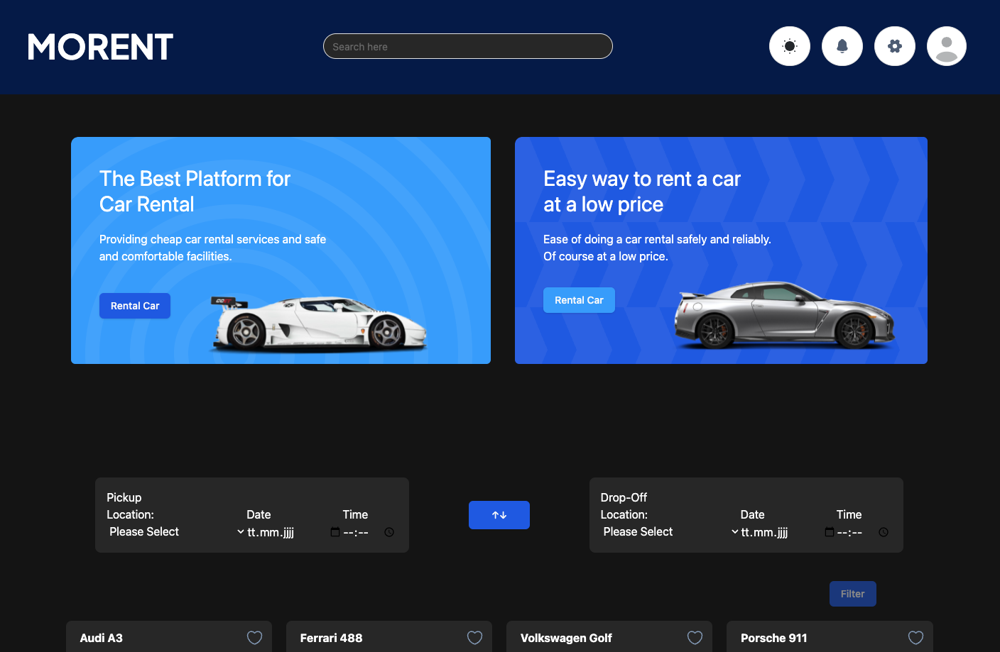

# Morent - Car rental 🏎️

<div style="display: flex; justify-content: center;">
  
</div>
<br/>
As a team of three, we've created a dynamic car rental platform that caters to the diverse needs of our users. 
Our project is a web application designed to revolutionize the car rental experience. Users can easily search for available vehicles across Germany, filter results based on their specific needs, and book rentals with just a few clicks. With features like city-to-city rentals and advanced search filters, our platform offers a convenient and flexible solution for travelers and locals alike.

## Table of Contents 📑

- [Deployment](#deployment)
- [Demo](#demo)
- [Features](#features)
- [Tech Stack](#tech-stack)
- [Getting Started](#getting-started)
- [Usage](#usage)
- [Database](#database)
- [Authentication](#authentication)
- [Backend Routes](#backend-routes)
- [Design](#design)
- [Libraries & Tools](#libraries--tools)
- [Contributors](#contributors)

## Deployment

The "Morent" project is deployed using Netlify, making it easily accessible to everyone.

### Demo
The live version of our Website  can be accessed here: 
[Our Website](https://project-morent-car-rental.netlify.app/)

## Features
We used React and Node.js to build a robust and scalable application.

### Filter
<div style="display: flex; justify-content: center;">
  
</div>
<br/>
 Search for rental cars in cities across Germany.
 Rent your favorite Car in on City and drop off in another!
We hade dvanced search filters integried: Refine your search by vehicle type, price, and CAPACITY.

### Profil Dropdown
<div style="display: flex; justify-content: center;">
  
</div>
<br/>
In your profile, you can easily access your booking history, saved favorite cars, and update your personal details.
 
 ### Fovorites
 <div style="display: flex; justify-content: center;">
  
</div>
<br/>
 you can favorated esaly the Cars 

<div style="display: flex; justify-content: center;">
  
</div>
<br/>
 and find them all in your Profil under "Favorites"

 ### My Bookings
 <div style="display: flex; justify-content: center;">
  
</div>
<br/>
You can also view all past bookings under your profile

### Payment Page
<div style="display: flex; justify-content: center;">
  
</div>
<br/>

The invoicing and payment process takes place directly on one page


### User Registration
<div style="display: flex; justify-content: center;">
  
</div>
<br/>
Users can register and log in so they have access to their own. Data and can, for example, view your old orders

### Darkmode
<div style="display: flex; justify-content: center;">
  
</div>
<br/>
For added comfort, we've included a dark mode option, easily accessible from the header. This eye-friendly feature reduces strain on your eyes, making your browsing experience more pleasant.


## Tech Stack


 


 <br/>
 
 


## Getting Started

To run Morent on your local machine, follow these steps:


### Installation

1. Clone this repository:

   ```bash
   git clone https://github.com/Anne-SophieNehls/Morent-CarRental
   ```

2. Navigate to the project directory:

   ```bash
   cd morent
   ```

3. Install dependencies:

   ```bash
   npm install
   ```

## Usage

1. Start the app:

   ```bash
   npm run dev
   ```

   The frontend server will run on http://localhost:5173.

2. Open the app in your browser at http://localhost:5173.

3. Register a new account or log in with the following credentials:

   ```bash
   E-mail:
    Password:
    First Name:
    Last Name:
    Profile Picture, optional:
   ```

4. Explore the Web-App!

5. To stop the server, press `Ctrl + C`.


## Database
We used Supabase as a database, here we can quickly and easily set up data tables, link them and maintain the policie


### Authentication
Our Page uses JWT authentication. The app generates a JWT token when a user registers or logs in. The token is stored in local storage and is used to authenticate the user for protected routes. The token is valid for 24 hours. The Web-App uses the `jsonwebtoken` library to generate and verify tokens. The app uses the `bcrypt` library to hash passwords. The app uses the `axios` library to make HTTP requests.


### Backend Routes
`/` - HomePage 
<br/>
`/details/:id` - DetailsPage 
<br/>
`/login` - LoginPage 
<br/>
`/sign-up` - SignUpPage 
<br/>
`/bookings` - BookingPage 
<br/>
`/favorites/:user_id` - FavoritesPage 
<br/>
`/profile/:id` - ProfilePage 
<br/>
`/rent/:id` - RentPage 


## Design

The Web-App's UI/UX was designed and Figma The app's wireframes were designed using Figma
[to the Figmaboard](https://www.figma.com/design/twugK8WykfNtQEiSJQf3FR/Car-Rent-Website-Design---Abschluss-Projekt-(Copy)?node-id=1-5&node-type=canvas&t=hasJ8sb9aChDel2o-0)


## Libraries & Tools

The Morent Web-App uses the following third-party libraries:
- `jsonwebtoken` - An implementation of JSON Web Tokens.
- `react-router-dom` - DOM bindings for React Router.
- `shadcn` - Is a Librarie for CSS Components coded with Tailwind.
- `leaflet-js`- For the Map Components
- `TanStack Query v5` - Used for Fetches, Loading and Loding-error-handle


## Contributors

Special thanks to the following contributors for their hard work on this project:

- [Robin Stumpf](https://github.com/robin160401) - Backend Developer, Tailwind-Master & Frontend Developer
- [Steve Dwumah](https://github.com/SteveDwumah) - Backend Developer, Features & Frontend Developer
- [Anne-Sophie Nehls](https://github.com/Anne-SophieNehls) - Frontend Developer, Trellomaster & Git Master

Feel free to reach out with any questions or feedback.
